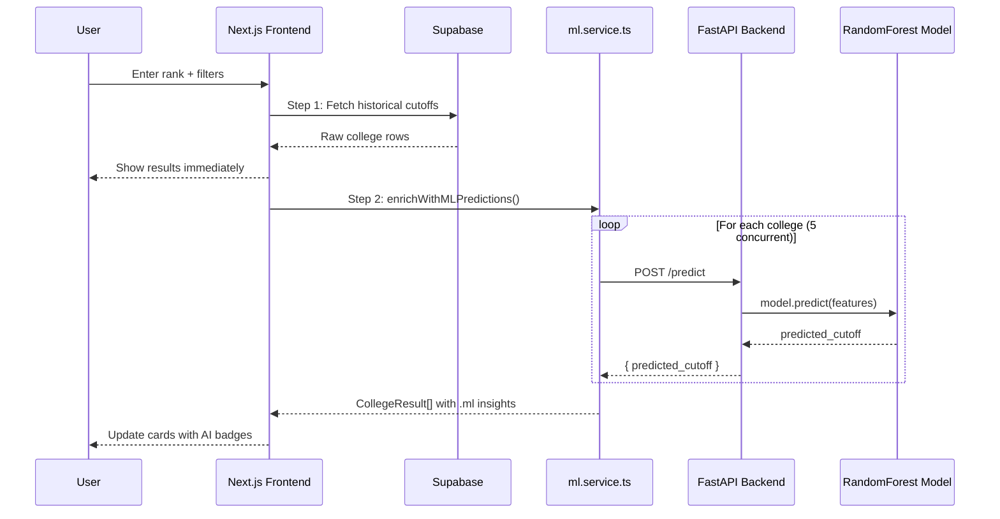

# Hybrid ML Integration — Complete Walkthrough

## Architecture Overview



## Files Changed

| File | Action | Purpose |
|------|--------|---------|
| [types/index.ts](file:///c:/Users/sanga/OneDrive/Desktop/kcet/types/index.ts) | **Rewritten** | Centralized TypeScript types for the entire app |
| [services/ml.service.ts](file:///c:/Users/sanga/OneDrive/Desktop/kcet/services/ml.service.ts) | **Created** | Reusable ML API service layer with timeout, concurrency, classification |
| [app/api/predict/route.ts](file:///c:/Users/sanga/OneDrive/Desktop/kcet/app/api/predict/route.ts) | **Rewritten** | Server-side proxy to FastAPI with validation & error handling |
| [ml/predict.py](file:///c:/Users/sanga/OneDrive/Desktop/kcet/ml/predict.py) | **Upgraded** | Added CORS, Pydantic validation, health endpoint, error handling |
| [app/predictor/page.tsx](file:///c:/Users/sanga/OneDrive/Desktop/kcet/app/predictor/page.tsx) | **Modified** | Hybrid prediction flow + ML insight UI in CollegeCard + summary banner |
| [.env.local](file:///c:/Users/sanga/OneDrive/Desktop/kcet/.env.local) | **Updated** | Added `NEXT_PUBLIC_ML_API_URL` |

## What Changed in Each File

### 1. `types/index.ts` — Centralized Types
- `RawCutoffRow` — shape of a Supabase `raw_cutoffs` row
- `MLPredictionRequest` / `MLPredictionResponse` — FastAPI contract
- `MLInsight` — predicted cutoff + chance + confidence + rank gap
- `CollegeResult` — extends `RawCutoffRow` with optional `ml?: MLInsight`
- `MLSummaryStats` — aggregate safe/moderate/dream counts
- `ChanceBadge` — `"safe" | "moderate" | "dream"`

### 2. `services/ml.service.ts` — ML Service Layer
- **`enrichWithMLPredictions(rows, userRank)`** — main entry point; calls FastAPI for each college with concurrency limiting (5 at a time)
- **`computeMLSummary(results)`** — builds aggregate stats for the summary banner
- **`classifyChance(userRank, predictedCutoff)`** — safe/moderate/dream logic
- **`checkMLHealth()`** — quick health check for the ML backend
- Includes 8-second timeout per request and graceful degradation (returns `null` on failure)

### 3. `app/api/predict/route.ts` — Server Proxy
- Validates all 5 required fields before forwarding
- Forwards to FastAPI with timeout protection
- Returns proper HTTP status codes (400, 502, 504, 500)
- Reads `ML_API_URL` (server-side secret) or falls back to `NEXT_PUBLIC_ML_API_URL`

### 4. `ml/predict.py` — FastAPI Backend
- Added **CORS middleware** for cross-origin requests from localhost and Vercel
- Switched from raw `dict` to **Pydantic `PredictionRequest`** model
- Added `/health` endpoint for monitoring
- Proper error handling for unknown encoder labels (422 status)
- Uses `os.path` for model file loading (works on any deployment)

### 5. `app/predictor/page.tsx` — Predictor Page

> [!IMPORTANT]
> **Zero UI design changes.** All existing components, styles, colors, and layouts are preserved exactly.

**Prediction flow is now hybrid:**
1. Supabase results appear **instantly** (all filters preserved)
2. ML enrichment runs **in the background** — cards update with AI insights
3. If ML backend is down, everything still works (graceful degradation)

**New UI elements (additive only):**
- **ML Summary Banner** — shows "12 Safe · 8 Moderate · 5 Dream" after ML completes
- **ML Loading Indicator** — animated "AI is analyzing..." banner
- **ML Insight Row** in each CollegeCard — shows predicted cutoff, AI chance badge, confidence level

## Environment Variables

| Variable | Where | Purpose |
|----------|-------|---------|
| `NEXT_PUBLIC_SUPABASE_URL` | `.env.local` | Supabase project URL (unchanged) |
| `NEXT_PUBLIC_SUPABASE_ANON_KEY` | `.env.local` | Supabase anon key (unchanged) |
| `NEXT_PUBLIC_ML_API_URL` | `.env.local` | ML backend URL (client-side, used by `ml.service.ts`) |
| `ML_API_URL` | Server only | Optional server-side override for the API route proxy |
| `FRONTEND_URL` | Render (FastAPI) | Your Vercel URL, added to CORS allow-list |

## How to Run Locally

```bash
# Terminal 1: Start FastAPI ML backend
cd ml
pip install -r requirements.txt
uvicorn predict:app --reload --port 8000

# Terminal 2: Start Next.js frontend
cd kcet
npm run dev
```

## Production Deployment

- **Frontend (Vercel):** Set `NEXT_PUBLIC_ML_API_URL` to your Render URL
- **Backend (Render):** Set `FRONTEND_URL` to your Vercel URL for CORS
